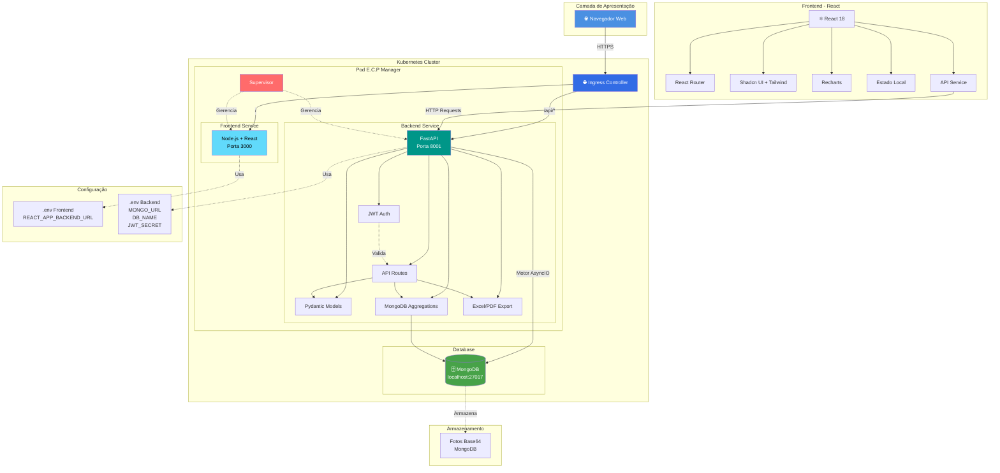

# Diagrama de Arquitetura do Sistema - E.C.P Manager

## Componentes da Arquitetura

### 1. Camada de Apresentação
- **Navegador Web**: Interface do usuário
- **Responsivo**: Mobile, Tablet, Desktop

### 2. Frontend (React)
- **React 18**: Framework UI
- **React Router**: Roteamento SPA
- **Shadcn UI**: Componentes acessíveis
- **Tailwind CSS**: Estilização
- **Recharts**: Visualizações de dados
- **Axios**: Cliente HTTP

### 3. Kubernetes Infrastructure
- **Ingress Controller**: Roteamento de tráfego
  - `/` → Frontend (porta 3000)
  - `/api/*` → Backend (porta 8001)
- **Supervisor**: Gerenciamento de processos
- **Hot Reload**: Desenvolvimento ágil

### 4. Backend (FastAPI)
- **FastAPI**: Framework Python assíncrono
- **JWT Authentication**: Autenticação segura
- **Pydantic**: Validação de dados
- **Motor**: Driver MongoDB assíncrono
- **Aggregation Pipelines**: Queries otimizadas
- **OpenPyXL + ReportLab**: Exportações

### 5. Banco de Dados
- **MongoDB**: NoSQL database
- **Collections**:
  - usuarios
  - atletas
  - treinos
  - presencas
  - partidas
  - patrocinadores
  - recebimentos
  - despesas

### 6. Segurança
- **JWT Tokens**: Autenticação stateless
- **Bcrypt**: Hash de senhas
- **CORS**: Configurado para produção
- **HTTPS**: Kubernetes Ingress TLS

### 7. Performance
- **Aggregation Pipelines**: Processamento no banco
- **Async/Await**: I/O não bloqueante
- **Connection Pooling**: MongoDB Motor
- **Hot Reload**: Desenvolvimento rápido

## Fluxo de Requisição

1. **Usuário** acessa via navegador
2. **Ingress** roteia para frontend ou backend
3. **Frontend** faz requisições HTTP para backend
4. **Backend** valida JWT token
5. **Backend** executa aggregation pipeline no MongoDB
6. **MongoDB** retorna dados processados
7. **Backend** formata resposta (Pydantic)
8. **Frontend** atualiza UI com dados

## Escalabilidade

- **Horizontal**: Múltiplos pods no Kubernetes
- **Vertical**: Recursos ajustáveis por pod
- **Database**: MongoDB com replica set
- **Cache**: Potencial para Redis (futuro)
