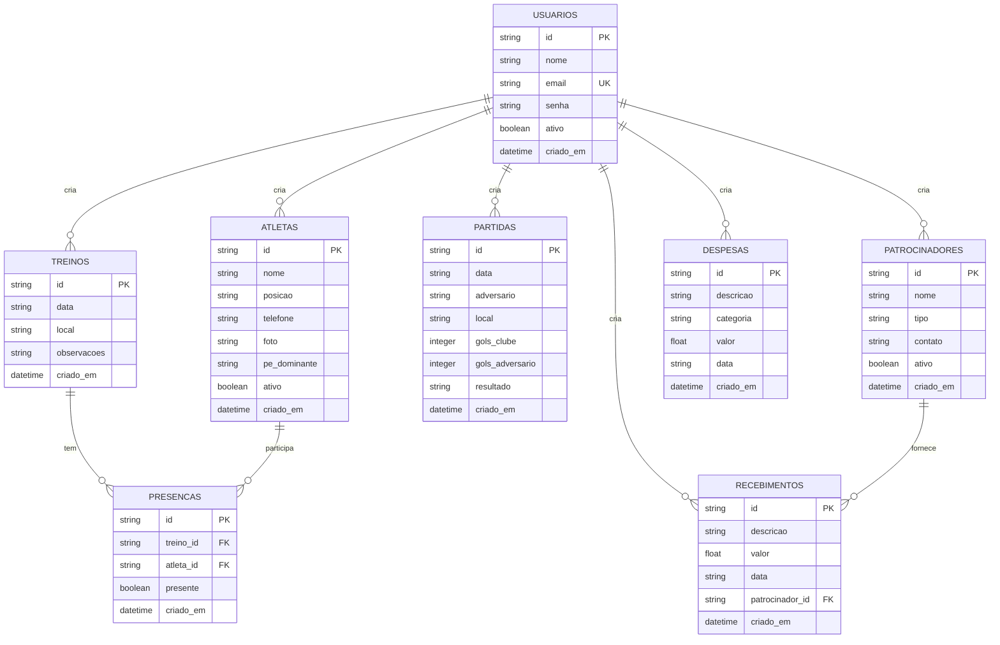

# Diagrama de Banco de Dados - E.C.P Manager



## Descrição das Collections

### 1. USUARIOS
Armazena dados dos administradores do sistema.

**Campos:**
- `id`: Identificador único (timestamp)
- `nome`: Nome completo do usuário
- `email`: Email único para login
- `senha`: Hash bcrypt da senha
- `ativo`: Status do usuário
- `criado_em`: Data de criação

**Índices:**
- `email`: Único para login rápido

---

### 2. ATLETAS
Cadastro completo dos atletas do clube.

**Campos:**
- `id`: Identificador único
- `nome`: Nome do atleta
- `posicao`: Posição em campo (Goleiro, Zagueiro, etc.)
- `telefone`: Telefone de contato
- `foto`: Imagem em base64 ou URL
- `pe_dominante`: 'direito', 'esquerdo' ou 'ambidestro'
- `ativo`: Status do atleta
- `criado_em`: Data de cadastro

**Índices:**
- `nome`: Para busca por nome
- `ativo`: Para filtrar ativos

---

### 3. TREINOS
Registro dos treinos realizados.

**Campos:**
- `id`: Identificador único
- `data`: Data do treino (YYYY-MM-DD)
- `local`: Local onde ocorreu
- `observacoes`: Anotações sobre o treino
- `criado_em`: Data de registro

**Índices:**
- `data`: Para ordenação e filtros

---

### 4. PRESENCAS
Relação N:N entre treinos e atletas.

**Campos:**
- `id`: Identificador único
- `treino_id`: Referência ao treino
- `atleta_id`: Referência ao atleta
- `presente`: Boolean indicando presença
- `criado_em`: Data de registro

**Índices:**
- `treino_id`: Para lookup de presenças
- `atleta_id`: Para histórico do atleta
- Composto `(treino_id, atleta_id)`: Única presença por treino

---

### 5. PARTIDAS
Registro dos jogos do clube.

**Campos:**
- `id`: Identificador único
- `data`: Data da partida
- `adversario`: Nome do time adversário
- `local`: Local do jogo
- `gols_clube`: Gols marcados pelo E.C.P
- `gols_adversario`: Gols do adversário
- `resultado`: 'Vitória', 'Empate' ou 'Derrota' (calculado)
- `criado_em`: Data de registro

**Índices:**
- `data`: Para ordenação
- `resultado`: Para estatísticas

---

### 6. PATROCINADORES
Cadastro de patrocinadores do clube.

**Campos:**
- `id`: Identificador único
- `nome`: Nome do patrocinador
- `tipo`: Tipo de patrocínio
- `contato`: Telefone/email de contato
- `ativo`: Status do patrocínio
- `criado_em`: Data de cadastro

**Índices:**
- `ativo`: Para filtrar ativos

---

### 7. RECEBIMENTOS
Receitas do clube.

**Campos:**
- `id`: Identificador único
- `descricao`: Descrição da receita
- `valor`: Valor em reais
- `data`: Data do recebimento
- `patrocinador_id`: Referência ao patrocinador (opcional)
- `criado_em`: Data de registro

**Índices:**
- `data`: Para filtros por período
- `patrocinador_id`: Para lookup

---

### 8. DESPESAS
Despesas do clube.

**Campos:**
- `id`: Identificador único
- `descricao`: Descrição da despesa
- `categoria`: Categoria da despesa
- `valor`: Valor em reais
- `data`: Data da despesa
- `criado_em`: Data de registro

**Índices:**
- `data`: Para filtros por período
- `categoria`: Para agrupamentos

---

## Relacionamentos

### 1. Treinos ↔ Atletas (N:N)
Através da collection PRESENCAS:
- Um treino tem várias presenças
- Um atleta participa de vários treinos
- Presença registra se o atleta compareceu

### 2. Patrocinadores ↔ Recebimentos (1:N)
- Um patrocinador pode ter vários recebimentos
- Um recebimento pode estar vinculado a um patrocinador
- Relacionamento opcional (receitas avulsas)

### 3. Usuários → Todas as Collections
- Todas as ações são realizadas por usuários autenticados
- Não armazenamos `user_id` nos documentos (simplificação)
- Auditoria pode ser implementada via logs

## Queries Otimizadas

### Aggregation Pipeline - Treinos com Presenças
```javascript
db.treinos.aggregate([
  {
    $lookup: {
      from: "presencas",
      localField: "id",
      foreignField: "treino_id",
      as: "presencas"
    }
  },
  {
    $addFields: {
      total_presencas: {
        $size: {
          $filter: {
            input: "$presencas",
            cond: { $eq: ["$$this.presente", true] }
          }
        }
      }
    }
  }
])
```

### Aggregation Pipeline - Estatísticas Financeiras
```javascript
db.recebimentos.aggregate([
  {
    $match: { data: { $regex: "^2024" } }
  },
  {
    $group: {
      _id: { $substr: ["$data", 5, 2] },
      total: { $sum: "$valor" }
    }
  }
])
```

## Considerações de Performance

1. **Índices Criados**: Otimizar queries frequentes
2. **Aggregation Pipelines**: Processamento no banco
3. **Limites de Resultado**: Máximo 1000 documentos
4. **Projeções**: Excluir `_id` nas queries
5. **Connection Pooling**: Motor mantém pool de conexões
