# Diagrama de Casos de Uso - E.C.P Manager

```mermaid
graph TB
    %% Atores
    Admin[👤 Administrador/Diretoria]
    
    %% Casos de Uso - Autenticação
    subgraph Autenticação
        UC1[Login]
        UC2[Logout]
        UC3[Registro de Usuário]
    end
    
    %% Casos de Uso - Gestão de Atletas
    subgraph "Gestão de Atletas"
        UC4[Cadastrar Atleta]
        UC5[Editar Atleta]
        UC6[Excluir Atleta]
        UC7[Listar Atletas]
        UC8[Buscar Atleta]
        UC9[Upload Foto Atleta]
        UC10[Definir Pé Dominante]
    end
    
    %% Casos de Uso - Gestão de Treinos
    subgraph "Gestão de Treinos"
        UC11[Cadastrar Treino]
        UC12[Editar Treino]
        UC13[Excluir Treino]
        UC14[Listar Treinos]
        UC15[Registrar Presença]
        UC16[Visualizar Presenças]
    end
    
    %% Casos de Uso - Gestão de Partidas
    subgraph "Gestão de Partidas"
        UC17[Cadastrar Partida]
        UC18[Editar Partida]
        UC19[Excluir Partida]
        UC20[Listar Partidas]
        UC21[Visualizar Resultado]
    end
    
    %% Casos de Uso - Gestão Financeira
    subgraph "Gestão Financeira"
        UC22[Cadastrar Receita]
        UC23[Cadastrar Despesa]
        UC24[Cadastrar Patrocinador]
        UC25[Listar Movimentações]
        UC26[Visualizar Saldo]
        UC27[Editar Transação]
        UC28[Excluir Transação]
    end
    
    %% Casos de Uso - Dashboard e Relatórios
    subgraph "Dashboard e Relatórios"
        UC29[Visualizar Dashboard]
        UC30[Filtrar por Período]
        UC31[Visualizar Gráficos]
        UC32[Exportar para Excel]
        UC33[Exportar para PDF]
        UC34[Gerar Relatório Financeiro]
        UC35[Gerar Relatório de Atletas]
        UC36[Gerar Relatório de Treinos]
        UC37[Gerar Relatório de Partidas]
    end
    
    %% Relacionamentos
    Admin --> UC1
    Admin --> UC2
    Admin --> UC3
    
    Admin --> UC4
    Admin --> UC5
    Admin --> UC6
    Admin --> UC7
    Admin --> UC8
    UC4 --> UC9
    UC4 --> UC10
    UC5 --> UC9
    UC5 --> UC10
    
    Admin --> UC11
    Admin --> UC12
    Admin --> UC13
    Admin --> UC14
    Admin --> UC15
    Admin --> UC16
    
    Admin --> UC17
    Admin --> UC18
    Admin --> UC19
    Admin --> UC20
    Admin --> UC21
    
    Admin --> UC22
    Admin --> UC23
    Admin --> UC24
    Admin --> UC25
    Admin --> UC26
    Admin --> UC27
    Admin --> UC28
    
    Admin --> UC29
    Admin --> UC30
    Admin --> UC31
    Admin --> UC32
    Admin --> UC33
    Admin --> UC34
    Admin --> UC35
    Admin --> UC36
    Admin --> UC37
    
    %% Includes
    UC29 -.->|includes| UC31
    UC32 -.->|includes| UC25
    UC33 -.->|includes| UC25
    UC34 -.->|includes| UC25
    UC35 -.->|includes| UC7
    UC36 -.->|includes| UC14
    UC37 -.->|includes| UC20
    
    style Admin fill:#0A1F51,color:#fff
    style UC1 fill:#FFC107,color:#0A1F51
    style UC29 fill:#28A745,color:#fff
```

## Descrição dos Casos de Uso

### 1. Autenticação
- **Login**: Usuário realiza autenticação no sistema
- **Logout**: Usuário encerra sessão
- **Registro**: Cadastro de novos usuários da diretoria

### 2. Gestão de Atletas
- **Cadastrar/Editar/Excluir**: CRUD completo de atletas
- **Listar/Buscar**: Visualização e pesquisa de atletas
- **Upload Foto**: Adicionar foto do atleta
- **Pé Dominante**: Definir pé dominante (direito/esquerdo/ambidestro)

### 3. Gestão de Treinos
- **CRUD Treinos**: Gerenciamento completo de treinos
- **Registrar Presença**: Marcar presença de atletas nos treinos
- **Visualizar Presenças**: Ver histórico de presenças

### 4. Gestão de Partidas
- **CRUD Partidas**: Gerenciamento de jogos
- **Resultado Automático**: Sistema calcula vitória/empate/derrota

### 5. Gestão Financeira
- **Receitas e Despesas**: Controle financeiro completo
- **Patrocinadores**: Gerenciamento de patrocínios
- **Saldo**: Cálculo automático do saldo

### 6. Dashboard e Relatórios
- **Dashboard**: Visão geral com KPIs
- **Gráficos**: Visualizações interativas
- **Exportações**: Excel e PDF
- **Relatórios**: Diversos tipos de relatórios
