# Diagrama de Classes - E.C.P Manager

## Backend (Python/FastAPI)

```mermaid
classDiagram
    %% Models
    class Usuario {
        +string id
        +string nome
        +string email
        +string senha
        +boolean ativo
        +datetime criado_em
    }
    
    class Atleta {
        +string id
        +string nome
        +string posicao
        +string telefone
        +string foto
        +string pe_dominante
        +boolean ativo
        +datetime criado_em
    }
    
    class Treino {
        +string id
        +string data
        +string local
        +string observacoes
        +datetime criado_em
    }
    
    class Presenca {
        +string id
        +string treino_id
        +string atleta_id
        +boolean presente
        +datetime criado_em
    }
    
    class Partida {
        +string id
        +string data
        +string adversario
        +string local
        +int gols_clube
        +int gols_adversario
        +string resultado
        +datetime criado_em
        +calcular_resultado() string
    }
    
    class Patrocinador {
        +string id
        +string nome
        +string tipo
        +string contato
        +boolean ativo
        +datetime criado_em
    }
    
    class Recebimento {
        +string id
        +string descricao
        +float valor
        +string data
        +string patrocinador_id
        +datetime criado_em
    }
    
    class Despesa {
        +string id
        +string descricao
        +string categoria
        +float valor
        +string data
        +datetime criado_em
    }
    
    %% Create Models
    class UsuarioCreate {
        +string nome
        +string email
        +string senha
    }
    
    class AtletaCreate {
        +string nome
        +string posicao
        +string telefone
        +string foto
        +string pe_dominante
        +boolean ativo
    }
    
    %% Response Models
    class UsuarioResponse {
        +string id
        +string nome
        +string email
        +boolean ativo
    }
    
    class AtletaResponse {
        +string id
        +string nome
        +string posicao
        +string telefone
        +string foto
        +string pe_dominante
        +boolean ativo
    }
    
    class TreinoResponse {
        +string id
        +string data
        +string local
        +string observacoes
        +int total_presencas
    }
    
    class DashboardStats {
        +int total_atletas_ativos
        +int total_treinos
        +int total_partidas
        +float total_receitas
        +float total_despesas
        +float saldo
        +int vitorias
        +int empates
        +int derrotas
    }
    
    %% Auth Classes
    class AuthService {
        -string JWT_SECRET
        -string JWT_ALGORITHM
        +hash_password(password) string
        +verify_password(plain, hashed) boolean
        +create_access_token(data) string
        +get_current_user(token) Usuario
    }
    
    %% Database
    class DatabaseService {
        -AsyncIOMotorClient client
        -Database db
        +connect() void
        +disconnect() void
        +get_collection(name) Collection
    }
    
    %% API Routes
    class AuthRouter {
        +register(UsuarioCreate) UsuarioResponse
        +login(UsuarioLogin) TokenResponse
        +get_me(token) UsuarioResponse
    }
    
    class AtletasRouter {
        +list_atletas() List~AtletaResponse~
        +create_atleta(AtletaCreate) AtletaResponse
        +get_atleta(id) AtletaResponse
        +update_atleta(id, AtletaCreate) AtletaResponse
        +delete_atleta(id) void
    }
    
    class TreinosRouter {
        +list_treinos() List~TreinoResponse~
        +create_treino(TreinoCreate) TreinoResponse
        +get_treino(id) TreinoResponse
        +update_treino(id, TreinoCreate) TreinoResponse
        +delete_treino(id) void
    }
    
    class PresencasRouter {
        +get_presencas_treino(treino_id) List~dict~
        +save_presencas_bulk(PresencaBulk) dict
    }
    
    class DashboardRouter {
        +get_stats(mes, ano) DashboardStats
        +get_charts(ano) dict
    }
    
    class ExportService {
        +export_excel(tipo) StreamingResponse
        +export_pdf(tipo) StreamingResponse
        -generate_excel(data) BytesIO
        -generate_pdf(data) BytesIO
    }
    
    %% Relationships
    Usuario --> UsuarioCreate : creates from
    Usuario --> UsuarioResponse : converts to
    Atleta --> AtletaCreate : creates from
    Atleta --> AtletaResponse : converts to
    Treino --> TreinoResponse : converts to
    
    Treino "1" --> "*" Presenca : tem
    Atleta "1" --> "*" Presenca : participa
    Patrocinador "1" --> "*" Recebimento : fornece
    
    AuthRouter --> AuthService : uses
    AuthService --> DatabaseService : uses
    
    AtletasRouter --> DatabaseService : uses
    AtletasRouter --> AuthService : protected by
    
    TreinosRouter --> DatabaseService : uses
    TreinosRouter --> AuthService : protected by
    
    PresencasRouter --> DatabaseService : uses
    PresencasRouter --> AuthService : protected by
    
    DashboardRouter --> DatabaseService : uses
    DashboardRouter --> AuthService : protected by
    
    ExportService --> DatabaseService : uses
    ExportService --> AuthService : protected by
```

---

## Frontend (React/TypeScript)

```mermaid
classDiagram
    %% Pages
    class LoginPage {
        -formData: object
        -loading: boolean
        +handleSubmit() void
        +handleLogin() void
        +handleRegister() void
    }
    
    class DashboardPage {
        -stats: DashboardStats
        -charts: object
        -mes: number
        -ano: number
        +loadData() void
        +handleFilterChange() void
    }
    
    class AtletasPage {
        -atletas: Atleta[]
        -filteredAtletas: Atleta[]
        -searchTerm: string
        -open: boolean
        -formData: AtletaForm
        +loadAtletas() void
        +handleSubmit() void
        +handleEdit(atleta) void
        +handleDelete(id) void
        +handleImageChange(file) void
    }
    
    class TreinosPage {
        -treinos: Treino[]
        -presencas: Presenca[]
        -selectedTreino: Treino
        +loadTreinos() void
        +openPresenca(treino) void
        +savePresencas() void
    }
    
    class PartidasPage {
        -partidas: Partida[]
        +loadPartidas() void
        +getResultadoBadge(resultado) JSX
    }
    
    class FinanceiroPage {
        -recebimentos: Recebimento[]
        -despesas: Despesa[]
        -patrocinadores: Patrocinador[]
        -activeTab: string
        +loadData() void
        +calculateTotals() object
    }
    
    class RelatoriosPage {
        +handleExport(tipo, formato) void
    }
    
    %% Components
    class Layout {
        -mobileMenuOpen: boolean
        +handleLogout() void
        +SidebarContent() JSX
    }
    
    class Card {
        +children: ReactNode
        +className: string
    }
    
    class Button {
        +onClick: Function
        +variant: string
        +size: string
        +disabled: boolean
    }
    
    class Dialog {
        +open: boolean
        +onOpenChange: Function
        +children: ReactNode
    }
    
    class Table {
        +children: ReactNode
    }
    
    class Chart {
        +data: array
        +type: string
    }
    
    %% Services
    class APIService {
        -baseURL: string
        -token: string
        +get(url) Promise
        +post(url, data) Promise
        +put(url, data) Promise
        +delete(url) Promise
        +setToken(token) void
        +interceptRequest() void
        +interceptResponse() void
    }
    
    %% Models
    class Atleta {
        +id: string
        +nome: string
        +posicao: string
        +telefone: string
        +foto: string
        +pe_dominante: string
        +ativo: boolean
    }
    
    class Treino {
        +id: string
        +data: string
        +local: string
        +observacoes: string
        +total_presencas: number
    }
    
    class Partida {
        +id: string
        +data: string
        +adversario: string
        +local: string
        +gols_clube: number
        +gols_adversario: number
        +resultado: string
    }
    
    %% Context
    class AuthContext {
        -user: Usuario
        -token: string
        -isAuthenticated: boolean
        +login(credentials) void
        +logout() void
        +setUser(user) void
    }
    
    %% Routing
    class AppRouter {
        +PrivateRoute(component) JSX
        +PublicRoute(component) JSX
    }
    
    %% Relationships
    LoginPage --> APIService : uses
    LoginPage --> AuthContext : uses
    
    DashboardPage --> APIService : uses
    DashboardPage --> Chart : renders
    DashboardPage --> Card : renders
    
    AtletasPage --> APIService : uses
    AtletasPage --> Dialog : uses
    AtletasPage --> Card : renders
    
    TreinosPage --> APIService : uses
    TreinosPage --> Table : renders
    
    FinanceiroPage --> APIService : uses
    FinanceiroPage --> Table : renders
    
    RelatoriosPage --> APIService : uses
    RelatoriosPage --> Card : renders
    
    Layout --> Button : contains
    Layout --> AuthContext : uses
    
    APIService --> AuthContext : uses
    AppRouter --> AuthContext : uses
    
    AtletasPage --> Atleta : manages
    TreinosPage --> Treino : manages
    PartidasPage --> Partida : manages
```

---

## Padrões de Design Utilizados

### Backend
1. **Repository Pattern**: DatabaseService abstrai acesso ao MongoDB
2. **Service Pattern**: AuthService, ExportService
3. **DTO Pattern**: Create/Response models separados
4. **Dependency Injection**: FastAPI Depends
5. **Middleware Pattern**: CORS, Authentication

### Frontend
1. **Component Pattern**: Componentes reutilizáveis
2. **Container/Presenter**: Pages (container) + Components (presenter)
3. **Service Pattern**: APIService centralizado
4. **Context API**: AuthContext para estado global
5. **Compound Components**: Dialog, Table, Card

## Princípios SOLID Aplicados

- **S** - Single Responsibility: Cada classe tem uma responsabilidade
- **O** - Open/Closed: Extensível via herança de BaseModel
- **L** - Liskov Substitution: Response models substituem Models
- **I** - Interface Segregation: Create/Response models específicos
- **D** - Dependency Inversion: Injeção de dependências no FastAPI
