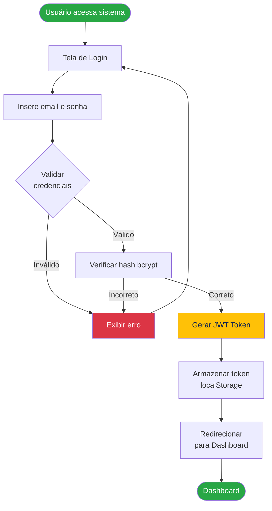
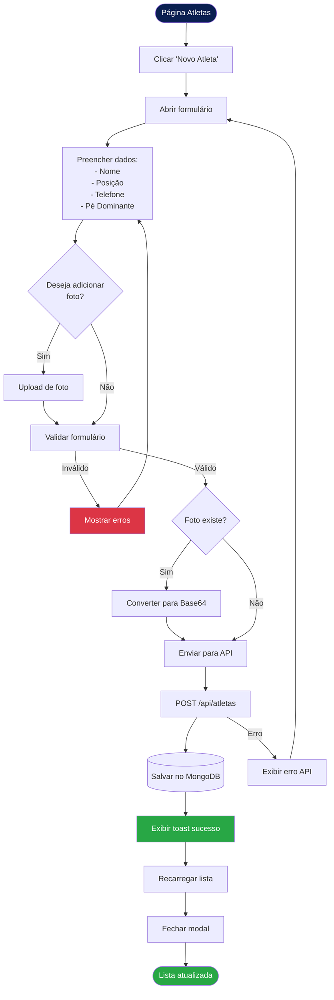
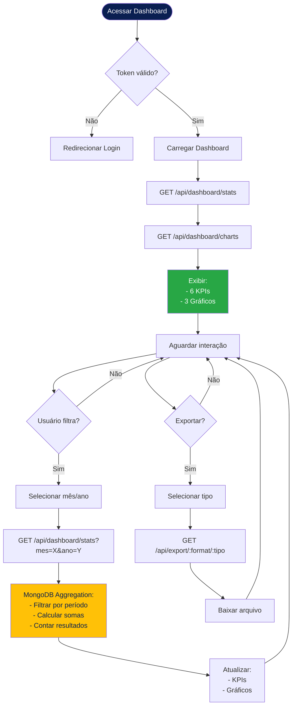
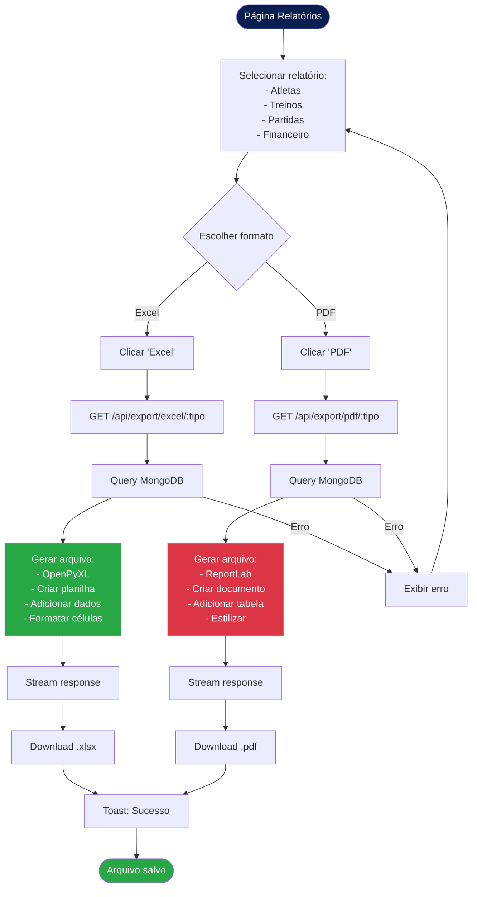
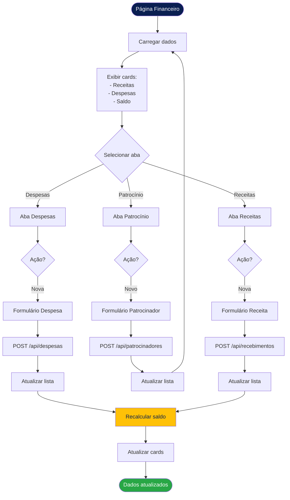

# Fluxogramas - E.C.P Manager

## 1. Fluxograma de Autenticação



---

## 2. Fluxograma de Cadastro de Atleta



---

## 3. Fluxograma de Registro de Presença

```mermaid
flowchart TD
    Start([Página Treinos]) --> Select[Selecionar treino]
    Select --> ClickPresenca[Clicar 'N presentes']
    ClickPresenca --> Load[Carregar lista de atletas]
    Load --> API1[GET /api/presencas/treino/:id]
    
    API1 --> Display[Exibir lista com checkboxes]
    Display --> Mark[Marcar/desmarcar presenças]
    Mark --> Save[Clicar 'Salvar']
    
    Save --> Prepare[Preparar payload:
    treino_id
    presencas[]]
    Prepare --> API2[POST /api/presencas/bulk]
    
    API2 --> Delete[Deletar presenças antigas]
    Delete --> Insert[Inserir novas presenças]
    Insert --> Success[Toast: Sucesso]
    Success --> Close[Fechar modal]
    Close --> Reload[Recarregar treinos]
    Reload --> Update[Atualizar contador]
    Update --> End([Lista atualizada])
    
    API2 -->|Erro| Error[Exibir erro]
    Error --> Display
    
    style Start fill:#0A1F51,color:#fff
    style End fill:#28A745,color:#fff
    style Success fill:#28A745,color:#fff
    style Error fill:#DC3545,color:#fff
```

---

## 4. Fluxograma de Dashboard com Filtros



---

## 5. Fluxograma de Exportação de Relatórios



---

## 6. Fluxograma de Gestão Financeira


